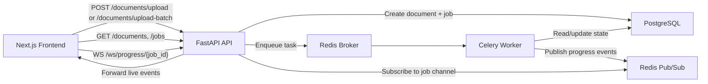

# Async Document Processing Workflow System

Production-style full-stack system for asynchronous document processing with clean service boundaries:

Frontend -> FastAPI API -> Redis/Celery -> Worker -> PostgreSQL -> Redis Pub/Sub -> WebSocket -> Frontend

## Architecture



## Stack

- Frontend: Next.js App Router, TypeScript, Tailwind CSS, TanStack Query, native WebSocket client
- API: FastAPI, Pydantic v2, SQLAlchemy async, PostgreSQL
- Async processing: Celery with Redis broker, Redis Pub/Sub for realtime progress
- Infra: Docker, Docker Compose, env-driven configuration
- Bonus included: Flower worker monitoring

## Service Design

### API service

- Accepts uploads and validates input
- Persists `documents`, `jobs`, and `extracted_data`
- Enqueues Celery jobs immediately and returns `202`
- Exposes REST endpoints plus `/ws/progress/{job_id}`
- Keeps routes thin via controller -> service -> repository layering

### Worker service

- Processes documents outside the request/response path
- Simulates parsing and extraction stages with deterministic structured output
- Publishes progress events for:
  - `job_received`
  - `job_queued`
  - `job_started`
  - `document_validation_started`
  - `document_validation_completed`
  - `parsing_started`
  - `parsing_completed`
  - `extraction_started`
  - `extraction_completed`
  - `post_processing_started`
  - `post_processing_completed`
  - `saving_results`
  - `job_completed`
  - `job_failed`
- Supports retry handling with exponential backoff hooks for transient failures
- Makes execution idempotent by short-circuiting already completed jobs

### Redis

- Celery broker/backend
- Pub/Sub transport for progress events

### PostgreSQL

- Normalized persistent state:
  - `documents`
  - `jobs`
  - `extracted_data`

### Frontend

- Upload page
- Dashboard with filter/search/sort/pagination
- Live progress page
- Document review/finalize/export page

## API Surface

### REST

- `POST /documents/upload`
- `POST /documents/upload-batch`
- `GET /documents`
- `GET /documents/{id}`
- `DELETE /documents/{id}`
- `GET /jobs/{id}`
- `POST /jobs/{id}/retry`
- `PATCH /documents/{id}/review`
- `POST /documents/{id}/finalize`
- `GET /documents/{id}/export?format=json|csv`
- `GET /health/live`
- `GET /health/ready`

### WebSocket

- `GET /ws/progress/{job_id}`

## Project Layout

```text
.
├── backend
│   ├── alembic
│   ├── app
│   │   ├── api
│   │   ├── core
│   │   ├── models
│   │   ├── repositories
│   │   ├── schemas
│   │   ├── services
│   │   ├── utils
│   │   └── workers
│   ├── scripts
│   └── pyproject.toml
├── frontend
│   ├── src
│   │   ├── app
│   │   ├── components
│   │   ├── hooks
│   │   └── services
│   └── package.json
├── docker-compose.yml
└── .env.example
```

## Data Model

### Document

- `id`
- `filename`
- `file_path`
- `status`
- `created_at`
- `updated_at`

### Job

- `id`
- `document_id`
- `status`
- `progress`
- `error_message`
- `celery_task_id`
- `attempt_number`
- `started_at`
- `completed_at`
- timestamps

### ExtractedData

- `id`
- `document_id`
- `title`
- `category`
- `summary`
- `keywords`
- `finalized`

## Local Setup

### 1. Prepare environment

```bash
cp .env.example .env
cp backend/.env.example backend/.env
cp frontend/.env.local.example frontend/.env.local
```

### 2. Start the full stack

```bash
docker compose up --build
```

### 3. Open the system

- Frontend: [http://localhost:3000](http://localhost:3000)
- API docs: [http://localhost:8000/docs](http://localhost:8000/docs)
- Flower: [http://localhost:5555](http://localhost:5555)

## Render Deployment

This repository includes `render.yaml` for a Render Blueprint deployment.

Services created by the Blueprint:

- `shiva-project-frontend`: Next.js Docker web service
- `shiva-project-api`: FastAPI Docker web service
- `shiva-project-worker`: Celery Docker background worker
- `shiva-project-db`: Render Postgres database
- `shiva-project-redis`: Render Key Value Redis-compatible instance

Deployment steps:

1. Push this folder to a GitHub repository.
2. In Render, open **Blueprints** and create a new Blueprint instance.
3. Connect the GitHub repository containing this project.
4. Render will read `render.yaml` and create the frontend, API, worker, Postgres, and Key Value resources.
5. After deployment, open:

```text
https://shiva-project-frontend.onrender.com
```

Important deployment notes:

- The Celery worker uses Render `starter` because Render does not provide free background workers.
- Postgres and Key Value are configured with free plans in `render.yaml`.
- Uploaded files use container-local storage at `/app/storage`; for long-term production durability, replace this with S3 or attach a persistent disk.
- If Render says a service name is already taken and changes the URL, update `NEXT_PUBLIC_API_BASE_URL`, `NEXT_PUBLIC_WS_BASE_URL`, and `ALLOWED_ORIGINS` in Render to match the final service URLs, then redeploy the frontend/API.

## Step-by-Step Execution Guide

1. Open the upload page and submit one or more documents.
2. The API stores the file under `backend/storage`, creates a `documents` row, creates a `jobs` row, enqueues Celery, and immediately returns `document_id` + `job_id`.
3. Celery pulls the job from Redis and moves it through the detailed validation, parsing, extraction, post-processing, and saving stages.
4. Each stage updates the job row and publishes a Redis Pub/Sub event.
5. The FastAPI WebSocket endpoint subscribes to `job-progress:{job_id}` and forwards those events to the browser.
6. When the worker completes, extracted data is persisted and available for review.
7. Users edit the extracted fields, finalize the reviewed record, and then export JSON or CSV.
8. Completed or failed documents can be deleted from the dashboard/detail page; queued/processing documents are protected until the worker finishes.

## Backend Design Decisions

- Service/repository separation keeps routes free of business logic.
- Redis Pub/Sub sits on the realtime path so horizontally scaled API replicas can forward worker progress without shared in-memory state.
- Jobs are tracked independently from documents so retries remain auditable.
- WebSocket clients subscribe by job rather than broad global channels to limit noise and reduce fan-out pressure.
- Alembic migrations are included instead of runtime `create_all` bootstrapping.
- Structured JSON logging and centralized exception handlers keep API behavior predictable.

## Tradeoffs

- Extraction is simulated, not OCR-backed. The pipeline structure is real; the parser logic is placeholder.
- Batch upload is implemented as a sequential API handoff so each file gets its own auditable document/job pair.
- Exports are intentionally locked until the extracted result is finalized, matching the assignment requirement for finalized records.
- The frontend uses the existing `src/`-based Next.js workspace instead of moving to a root-level `frontend/app` layout, which avoids colliding with existing local edits while preserving App Router architecture.
- File storage is local volume-backed for simplicity. The abstraction is ready for an S3 adapter but that adapter is not implemented here.

## Limitations

- Authentication/JWT was left out so the core async workflow stayed the priority.
- Cancel-job semantics are not implemented.
- Test coverage is minimal in this iteration.
- Retry logic is present for transient worker failures, but production hardening would add richer dead-letter handling and metrics.
- A 3-5 minute demo video still needs to be recorded before submission.

## Sample Files And Outputs

- Sample input file: `samples/sample-document.txt`
- Sample JSON export: `samples/sample-export.json`
- Sample CSV export: `samples/sample-export.csv`

## AI Tools Note

AI assistance was used during development for planning, implementation, debugging, UI redesign, and documentation support. The final project should still be reviewed and run locally before submission.

## Submission Checklist

- GitHub repository link: to be added when you push this project.
- Demo video: record a 3-5 minute walkthrough before submission.
- Sample input/output files: included under `samples/`.

## Useful Commands

### Backend syntax check

```bash
python3 -m compileall backend/app backend/alembic
```

### Frontend build

```bash
cd frontend
node ../node_modules/next/dist/bin/next build
```

### Worker only

```bash
docker compose up worker redis postgres
```

## Notes for Review

- Existing unrelated legacy frontend files were left in place when they did not conflict, to avoid trampling active workspace edits.
- The authoritative implementation for this system is the FastAPI/Celery backend plus the workflow-focused Next.js screens and services described above.
